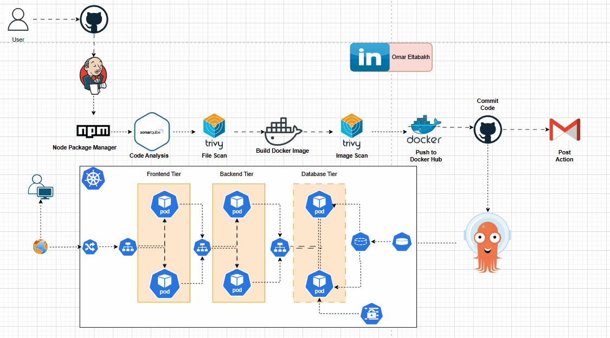

# Three-Tier DevSecOps Project




A modern Three-Tier DevSecOps application demonstrating a scalable, secure, and automated CI/CD pipeline. The project implements a React-based frontend, a Node.js/Express backend, and a MongoDB database, containerized with Docker, orchestrated with Kubernetes (k3s), and deployed using ArgoCD. The CI/CD pipeline leverages Jenkins, with SonarQube for code quality analysis and Trivy for security scanning, ensuring robust DevSecOps practices.
This repository serves as a reference for building production-ready, cloud-native applications with a focus on automation, security, and scalability.

##   Table of Contents

- [Project Overview](#project-overview)
- [Features](#features)
- [Architecture](#architecture)
- [Technologies Used](#technologies-used)
- [Project Structure](#project-structure)
- [Prerequisites](#prerequisites)
- [Setup Instructions](#setup-instructions)
- [Running the Application](#running-the-application)
- [Testing the Application](#testing-the-application)
- [CI/CD Pipeline](#cicd-pipeline)
- [Contributing](#contributing)
- [License](#license)
- [Author](#Author)

---

## Project Overview
This project showcases a Three-Tier web application deployed with a fully automated DevSecOps pipeline. The application consists of:

- **Frontend**: A React-based single-page application (SPA) serving a user interface.
- **Backend**: A Node.js/Express REST API handling business logic and data operations.
- **Database**: MongoDB for persistent data storage.

CI/CD Pipeline Summary:
- ✅ Code Quality Analysis: Performed using SonarQube (Static Code Analysis).
- 🔒 Security Scanning: Done with Trivy to detect vulnerabilities in Docker images.
- 🐳 Docker Image Building: Automatically builds Docker images from source code.
- 🚀 Continuous Deployment: Uses ArgoCD with GitOps for automated deployment.
- ☸️ Kubernetes Cluster: Deployed on a lightweight K3s Kubernetes cluster.
- 🎯 Objective: Ensure high code quality and security through a fully automated CI/CD pipeline.

--- 

## Features

- **🏗️ Scalable Architecture**: 
  - Three-tier design with isolated frontend, backend, and database   layers.
- **🐳 Containerization**:
  - Dockerized frontend and backend for consistency across environments.
- **🔁 Automated CI/CD**:
  - Jenkins pipeline to build, test, and push Docker images to Docker Hub.
- **🧪 Code Quality**:
  - Static code analysis and quality gates via SonarQube integration.
- **🔒 Security**:
  - Vulnerability scanning for code and images using Trivy.
- **🚀 GitOps Deployment**:
  - Declarative and automated deployment with ArgoCD to k3s.
- **🌐 Ingress Routing**:
  - External access enabled via NGINX Ingress Controller.
- **☸️ Lightweight Kubernetes**:
  - Uses k3s for efficient and lightweight clustering.
- **🔄 Extensible**:
  - Easily customizable to add monitoring, testing, or other DevSecOps tools.

---

## Architecture
The application follows a Three-Tier Architecture:
+-------------------+
|   React Frontend  |
|   (Port: 80)      |
+-------------------+
          |
          v

+-------------------+
| Node.js Backend   |
|   (Port: 5000)    |
+-------------------+
          |
          v
          
+-------------------+
| MongoDB Database  |
|   (Port: 27017)   |
+-------------------+


**CI/CD Pipeline**:
1. Jenkins fetches code from GitHub.
2. SonarQube analyzes code quality.
3. Trivy scans for vulnerabilities.
4. Docker images are built and pushed to Docker Hub.


**Deployment**:

5. ArgoCD syncs Kubernetes manifests from the kubernetes/ folder.
6. k3s cluster runs the application with NGINX Ingress for routing.


## Technologies Used

- Frontend: React, Nginx
- Backend: Node.js, Express, Mongoose
- Database: MongoDB
- Containerization: Docker
- Orchestration: Kubernetes (k3s)
- CI/CD: Jenkins
- Code Quality: SonarQube
- Security: Trivy
- GitOps: ArgoCD
- Ingress: NGINX Ingress Controller
- Version Control: Git, GitHub
- Container Registry: Docker Hub

## Project Structure

```plaintext

.
Three-Tier-DevSecOps/
├── frontend/                 # React frontend code
│   ├── Dockerfile            # Docker configuration for frontend
│   └── src/                  # React source files
├── backend/                  # Node.js backend code
│   ├── Dockerfile            # Docker configuration for backend
│   └── index.js              # Backend entry point
├── kubernetes/               # Kubernetes manifests
│   ├── frontend/             # Frontend deployment and service
│   ├── backend/              # Backend deployment and service
│   ├── mongodb/              # MongoDB deployment and service
│   └── ingress/              # Ingress configuration
├── Jenkinsfile               # Jenkins CI/CD pipeline definition
└── README.md                 # Project documentation
```
## Prerequisites

- Docker: For containerization.
- Jenkins: Running in a container on port 8080.
- k3s: Lightweight Kubernetes cluster.
- kubectl: For interacting with the Kubernetes cluster.
- Git: For version control.
- Docker Hub Account: For storing Docker images (username: omareltabakh).
- GitHub Repository: OmarEltabakh123/Three-Tier-DevSecOps.
- VM/Cloud Instance: With sufficient resources (4GB RAM, 2 CPUs recommended).

## Setup Instructions
1. ### clone the Repository
```bash
git clone https://github.com/OmarEltabakh123/Three-Tier-DevSecOps.git
cd Three-Tier-DevSecOps
```
2. ### set Up Jenkins

- **Ensure Jenkins is running**: http://<vm-ip>:8080.
- **Install required plugins**:
  - Docker Pipeline
  - SonarQube Scanner
  - Git


- **Configure credentials**:
  - Docker Hub: Add dockerhub-credentials (username, password).
  - SonarQube: Add sonarqube-token (generated from SonarQube).


- **Create a Pipeline job**:
  - Name: Three-Tier-DevSecOps
  - SCM: Git, URL: https://github.com/OmarEltabakh123/Three-Tier-DevSecOps.git
  - Script Path: Jenkinsfile


3. ### Configure SonarQube

 **Run SonarQube in a container**:docker run -d --name sonarqube -p 9000:9000 sonarqube:latest


 Access http://<vm-ip>:9000, log in (admin/admin), and change the password.
 Generate a token and add it to Jenkins credentials.

4. ### Install Trivy
**Install Trivy for vulnerability scanning**:
```bash
sudo apt-get update
sudo apt-get install -y wget
wget https://github.com/aquasecurity/trivy/releases/download/v0.53.0/trivy_0.53.0_Linux-64bit.deb
sudo dpkg -i trivy_0.53.0_Linux-64bit.deb
```
5. ### Set Up k3s Cluster

- **Install k3s**:
```bash
curl -sfL https://get.k3s.io | sh -
```

- **Copy kubeconfig**:
```bash
sudo cp /etc/rancher/k3s/k3s.yaml ~/.kube/config
sudo chmod 644 ~/.kube/config
```

- **verify cluster**:
```bash
kubectl get nodes
```


6. ### Install ArgoCD

- **Install ArgoCD**:
```bash
kubectl create namespace argocd
kubectl apply -n argocd -f https://raw.githubusercontent.com/argoproj/argo-cd/stable/manifests/install.yaml
```

- **Access ArgoCD UI**:
```bash
kubectl port-forward svc/argocd-server -n argocd 8081:443
```

- **URL**: http://localhost:8081
- **Username**: admin
- **Password**: 
```bash
kubectl -n argocd get secret argocd-initial-admin-secret -o jsonpath="{.data.password}" | base64 -d
```

- **Create an ArgoCD application**:
  - Name: three-tier
  - Repository: https://github.com/OmarEltabakh123/Three-Tier-DevSecOps.git
  - Path: kubernetes/(backend,frontend,mongodb,ingress)
  - Cluster: https://kubernetes.default.svc
  - Namespace: default


7. ### Configure Ingress

- **Install NGINX Ingress Controller**:
```bash
kubectl apply -f https://raw.githubusercontent.com/kubernetes/ingress-nginx/controller-v1.8.0/deploy/static/provider/cloud/deploy.yaml
```

- **Add to /etc/hosts on your local machine**:
```bash
echo "<vm-ip> three-tier.local" | sudo tee -a /etc/hosts
```

## Running the Application

1. Trigger the Jenkins pipeline (Build Now) to build and push Docker images.
2. Sync the ArgoCD application to deploy to k3s.
3. Access the application:
   - Frontend: http://three-tier.local
   - Backend: http://three-tier.local/api


## Testing the Application

- **Frontend**:
  - Open http://three-tier.local.
  - Verify the React app loads and displays data from the backend.


- **Backend**:
  - Test API:
```bash
curl http://three-tier.local/api
```
Expected: {"message": "Welcome to the Backend!"}

  - Test data endpoints:
```bash
curl -X POST http://three-tier.local/api/items -H "Content-Type: application/json" -d '{"name": "Test Item"}'
curl http://three-tier.local/api/items
```


- **Database**:
  - Connect to MongoDB:
```bash  
  kubectl run mongo-client --rm -i --tty --image mongo -- bash
mongosh mongodb://mongodb:27017/three-tier
```

## CI/CD Pipeline
- The Jenkins pipeline automates:

    - Checkout: Pulls code from GitHub.
    - SonarQube Analysis: Scans code quality.
    - Trivy Scan: Checks for vulnerabilities in code and images.
    - Docker Build: Builds frontend and backend images.
    - Docker Push: Pushes images to Docker Hub (omareltabakh/frontend:latest, omareltabakh/backend:latest).

## Contributing
- Contributions are welcome! To contribute:

   - Fork the repository.
   - Create a feature branch: git checkout -b feature-name.
   - Commit changes: git commit -m 'Add feature'.
   - Push to the branch: git push origin feature-name.
   - Open a Pull Request.

**Please follow the Code of Conduct and ensure tests pass.**

## License
- This project is licensed under the MIT License.

## Author 
  - **Omar Eltabakh**
- [GitHub](https://github.com/OmarEltabakh123)
- [Docker Hub](https://hub.docker.com/u/omareltabakh)
- [LinkedIn](https://linkedin.com/in/omar-eltabakh)  
- [Email](omar.ahmed.attia123@gmail.com)

- For issues or feature requests, please open an issue on the GitHub repository.

⭐ Star this repository if you find it useful! ⭐
